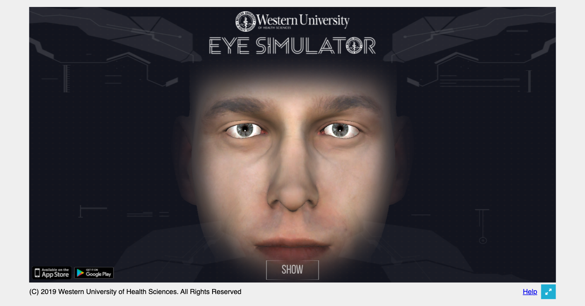
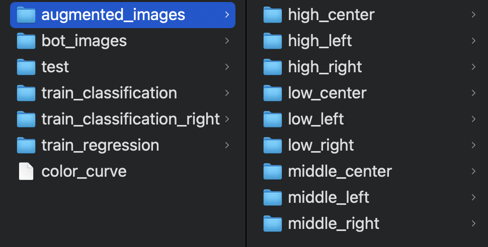
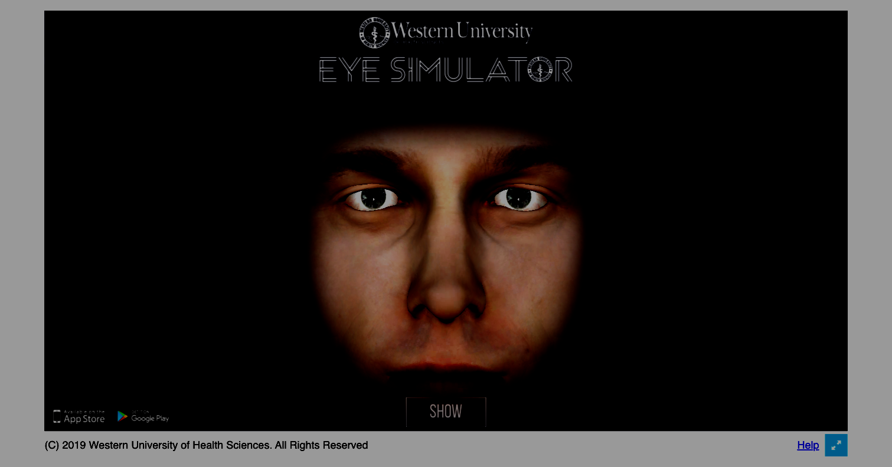
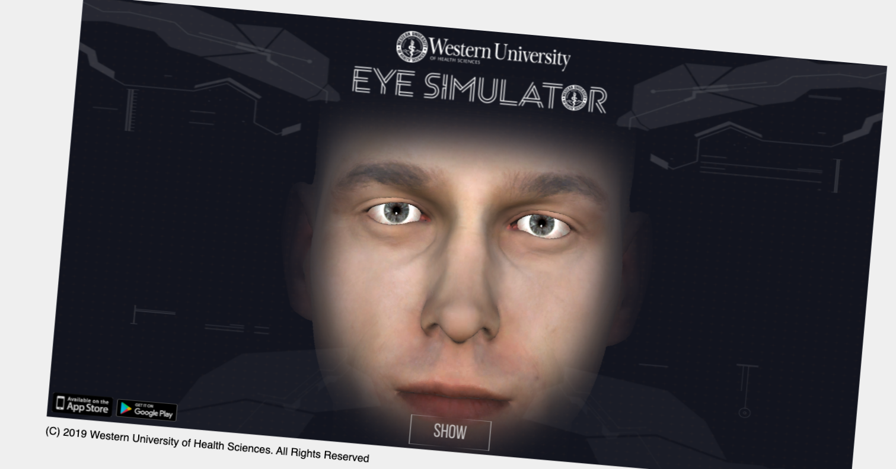
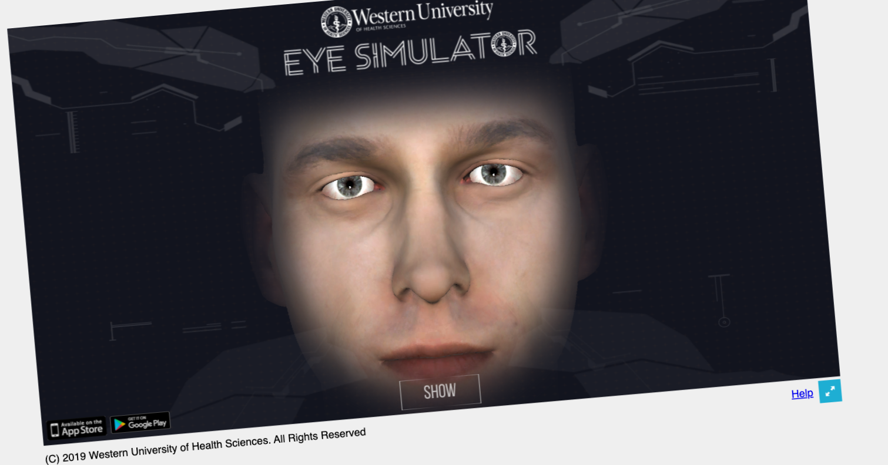
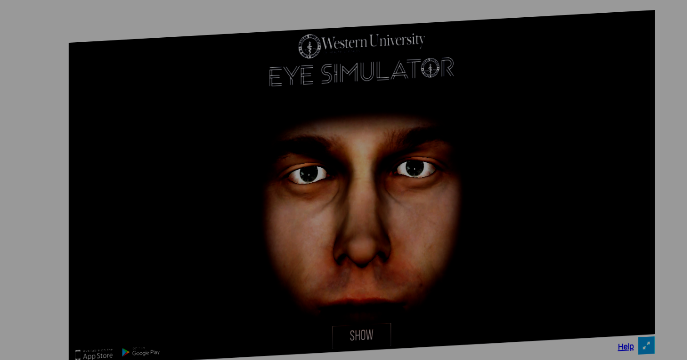
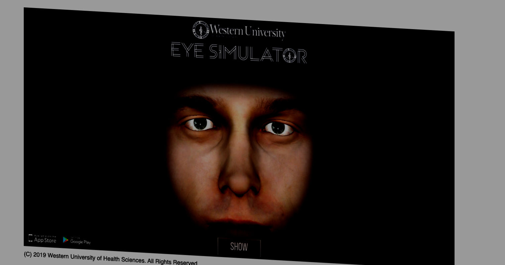
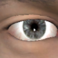

# Deep Eyes Recognition

# Obiettivi
L'obiettivo del seguente progetto didattico è la realizzazione di un modello Deep Learning di classificazione e regressione per il rilevamento della direzione degli occhi di volti acquisiti in maniera automatica mediante un simulatore.

# Progettazione dataset
## Generazione immagini
Il codice relativo alla cattura delle schermate è interamente contenuto nella cartella Javascript, per eseguirlo è necessario aver installato Node.JS <br />
Il dataset è stato creato realizzando un bot in Node.JS che acquisisse in maniera automatica le schermate della pagina web di un simulatore del volto umano. <br />
Il simulatore è disponibile al seguente [link](https://edtech.westernu.edu/3D-eye-movement-simulator/). <br />
E' inoltre presente un file di configurazione config.js, dove specificare:
```bash
//path where to save images
const save_path = "";

//classes (folders) where to save filtered mages
const classes = ["", ... , ""];

//mouse position on browser window for filtering
const coords = {
    "x_right": [,],
    "x_center": [,],
    "x_left": [,],
    "y_high": [,],
    "y_middle": [,],
    "y_low": [,]
};

//button to press for hiding text and blinking of simulator
const button_hide_blinking = [,];
const button_hide_text = [,];

//browser window size
const window_size = [,];

//delta for ciclying
const x_delta = ;
const y_delta = ;

//web page where take screenshots
const web_page = "";
```

Dopodiché, per avviare il programma è necessario posizionarsi nella cartella javascript da terminale ed eseguire:

```bash
node bot.js
```

Le immagini vengono salvate:
- con il nome composto dalle coordinate normalizzate rispetto ai valori massimi e minimi di coords;
- nella cartella opportuna tramite i filtri con le coordinate.

Struttura cartelle:


## Data augmentation e FaceMesh
La parte relativa alla data augmentation e FaceMesh è interamente contenuta nella cartella Python.<br />
Si è applicata della data augmentation:
Applicazione di curve di colore dell'immagine (tramite un modulo esterno chiamato [BIMP](https://alessandrofrancesconi.it/projects/bimp/): <br />


Rotazioni (+- 5°): <br />



Variazioni prospettiche: <br />



Le immagini aumentate sono salvate all'interno di una cartella chiamata data_augmentation, anch'essa contenente nove sottocartelle che identificano la classe di appartenenza dell'immagine. <br />

Successivamente, si è applicata la soluzione FaceMesh per ritagliare, a partire dalle immagini precedenti, le porzioni contenenti occhio destro e sinistro.  <br />
Per ultimo, tali immagini sono state ridimensionate come un quadrato di dimensione 100x100px. <br />



Tali immagini sono organizzate in maniera analoga a quelle precedenti, in un'altra cartella chiamata train.

# Modelli
I dataset di regressione e di classificazione sono disponibili al seguente [link](https://drive.google.com/drive/folders/1QZtyXVt7jE0Fdy4MyMG8Vjq0Oe6Rmt3Y?usp=sharing)
