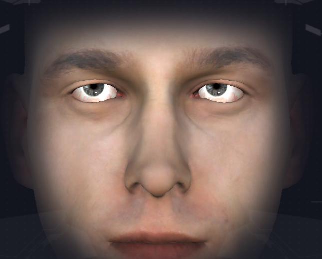
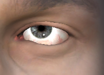
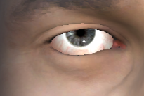
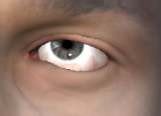
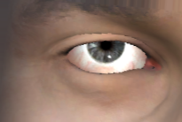
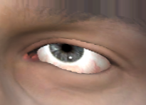
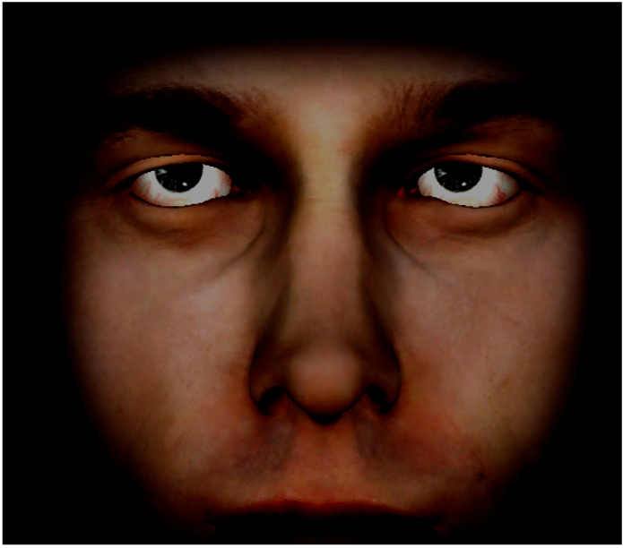

# Deep Eyes Recognition

# Indice
- [Obiettivi](#obiettivi)
- [Progettazione dataset ](#progettazionedataset)
- [Implementazione modello](#implementazione)

# Obiettivi
L'obiettivo del seguente progetto didattico è la realizzazione di un modello Deep Learning che classifichi la direzione degli occhi del volto umano.

# Progettazione dataset
Il dataset è stato creato realizzando un bot in Node.JS che acquisisse in maniera automatica le schermate della pagina web di un simulatore del viso umano.  

Successivamente, si è applicata la soluzione FaceMesh per ritagliare, a partire dalle schermate precedenti, le immagini contenenti esclusivamente occhio destro e sinistro.  

Ritagli:

Infine, si è applicata della data augmentation andando a modificare gli angoli, le prospettive e le curve di colore dell'immagine.  
Rotazione:

Prospettiva:

Curva di colore:

# Implementazione modello
Il modello è stato addestrato per riconoscere nove classi (quadranti) visibili nella seguente immagine.

La rete scelta è la MobileNet v2.