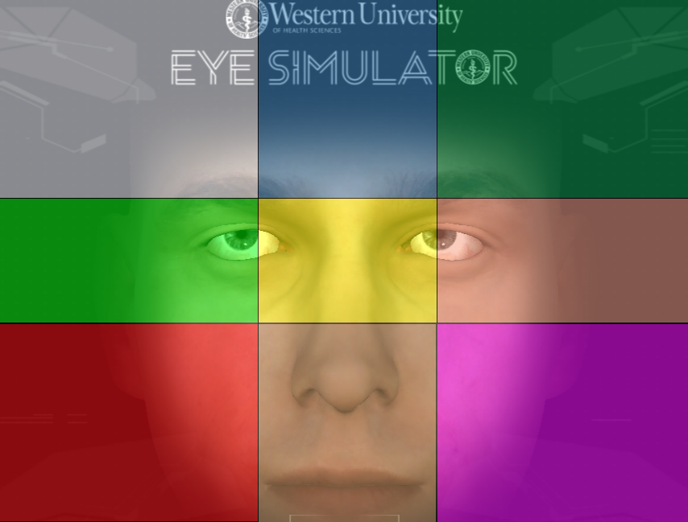

# Deep Eyes Recognition
# Indice
- [Obiettivi](#obiettivi)
- [Progettazione dataset](#progettazionedataset)
  - [Generazione immagini](#generazioneimmagini)
  - [Data augmentation e Face Mesh](#dataaugmentationefacemesh)
- [Modello di classificazione](#modellodiclassificazione)

# Obiettivi
L'obiettivo del seguente progetto didattico è la realizzazione di un modello Deep Learning che classifichi la direzione degli occhi relativi a volti virtuali acquisite in maniera automatica mediante un simulatore.

# Progettazione dataset
## Generazione immagini
Il dataset è stato creato realizzando un programma in Node.JS che acquisisse in maniera automatica le schermate della pagina web di un simulatore del viso umano. <br />
E' presente un file di configurazione config.js, dove specificare:

```bash
//path where to save images
const save_path = "";

//classes (folders) where to save filtered mages
const classes = ["", ... , ""];

//mouse position on browser window for filtering
const coords = {
    "x_right": [,],
    "x_center": [,],
    "x_left": [,],
    "y_high": [,],
    "y_middle": [,],
    "y_low": [,]
};
```
Dopodiché, per avviare il programma è necessario eseguire da terminale:
```bash
cd javascript
node bot.js
```

!!! Attenzione, il programma è configurato per lavorare con nove classi (cartelle), in caso di aggiunta o rimozione bisogna modificare le condizioni del filtraggio all'interno dell'applicazione principale. !!! <br />

Il salvataggio delle immagini avviene modificando il nome del file con le coordinate normalizzate rispetto ai valori massimi e minimi di coords.

## Data augmentation e FaceMesh
Si è applicata della data augmentation: rotazioni (+- 5°), variazioni prospettiche e applicazione di curve di colore dell'immagine (quest'ultima mediante un modulo esterno chiamato BIMP). <br />
Rotazioni:


Trasformazioni prospettiche:


Applicazione della curva di colore:


Le immagini aumentate sono salvate all'interno di una cartella chiamata data_augmentation, anch'essa contenente nove sottocartelle che identificano la classe di appartenenza dell'immagine. <br />
Successivamente, si è applicata la soluzione FaceMesh per ritagliare, a partire dalle immagini precedenti, le porzioni contenenti occhio destro e sinistro.  <br />
Tali immagini sono organizzate in maniera analoga a quelle precedenti, in un'altra cartella chiamata train.

# Modello di classificazione
Il modello è stato addestrato per riconoscere nove classi (quadranti) visibili nella seguente immagine.


La rete di classificazione scelta è la MobileNet v2. <br />
Ulteriori dettagli sono disponibili all'interno del file Colab della rete di classificazione. <br />